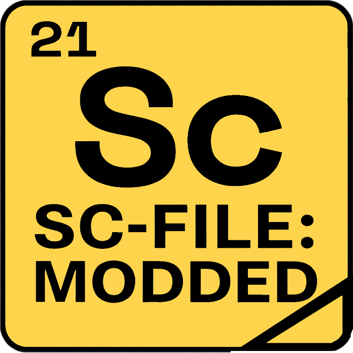
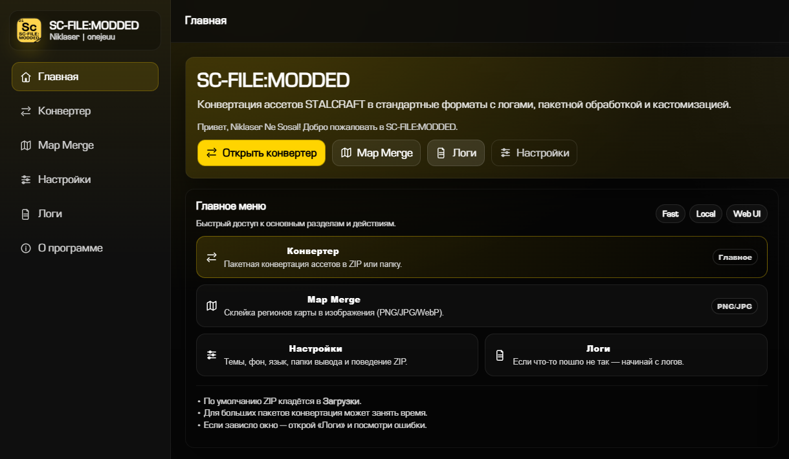
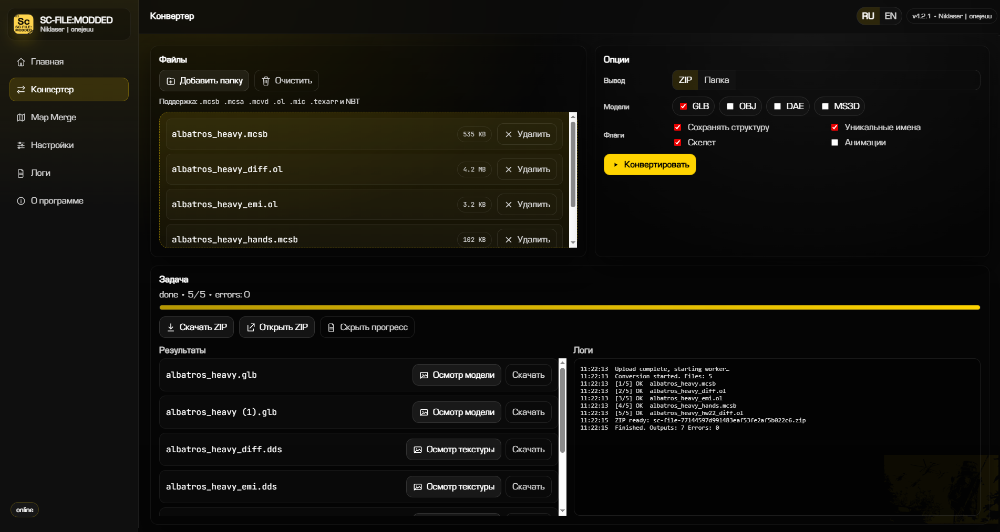
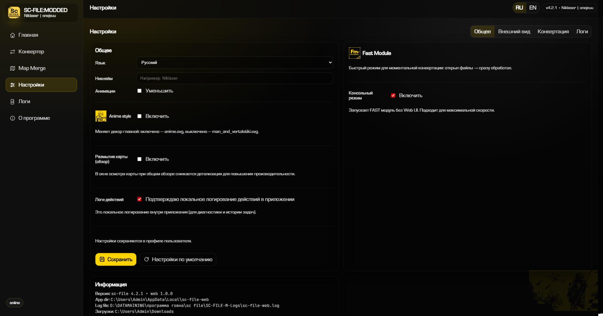

# SC-FILE:MODDED

<p align="center">
  
</p>

<p align="center">
  
  
  
  
  
</p>

<p align="center">
  <a href="https://github.com/onejeuu/sc-file" target="_blank" rel="noopener noreferrer">
    
  </a>
  <a href="https://github.com/onejeuu/sc-mapmerge" target="_blank" rel="noopener noreferrer">
    
  </a>
  <a href="https://github.com/Niklaser-Sosal/SC-FILE-MODDED" target="_blank" rel="noopener noreferrer">
    
  </a>
</p>

<p align="center">
  
</p>

<p align="center">
  
</p>

<p align="center">
  
</p>

## О программе

**SC-FILE:MODDED** — модифицированная версия `sc-file` с Web UI и desktop-окном на `pywebview`.

Проект предназначен для локальной работы: обработка файлов выполняется на вашем ПК.  
Интерфейс объединяет конвертацию ассетов и Map Merge в одном приложении, чтобы не переключаться между разными инструментами.

В этой версии используется оригинальная база **sc-file 4.3.0** и интеграция возможностей **sc-mapmerge**.

## Авторы

`Niklaser` — автор модифицированной версии | `onejeuu` — автор оригинальных проектов

- SC-FILE (original): https://github.com/onejeuu/sc-file
- SC-MAPMERGE (original): https://github.com/onejeuu/sc-mapmerge

## Возможности

- Пакетная конвертация в ZIP или папку
- Map Merge (склейка регионов карты)
- Осмотр карты в отдельном окне
- Осмотр моделей в отдельном окне
- Осмотр текстур (включая DDS preview)
- Темы, фон, шрифты, язык
- FAST-модуль для быстрой конвертации необходимых вам файлов
- Локальные логи и диагностика

## Оптимизация осмотров (актуально)

- Ускорен первый рендер в осмотрах за счёт параллельной загрузки настроек
- Уменьшена нагрузка prefetch в просмотре карты
- Кэширован preview для DDS (повторное открытие быстрее)
- Отложен тяжёлый рендер watermark до первого кадра интерфейса

## Быстрый старт (Windows)

1. Запуск с авто-проверкой зависимостей:
   ```bat
   scfile-web.bat
   ```
2. Принудительная переустановка зависимостей:
   ```bat
   scfile-setup.bat
   ```

## Сборка EXE (Windows)

```bat
sc-file-4.3.0\.venv\Scripts\python.exe -m PyInstaller scfile_webapp_entry.py --name SC-FILE_MODDED --clean --onefile --noconsole --paths sc-file-4.3.0 --paths sc-mapmerge-2.1.1 --add-data "webapp\static;webapp\static" -i webapp\static\app_icon.ico --hidden-import zstandard --hidden-import rich._unicode_data.unicode17-0-0 --hidden-import rich._unicode_data --collect-data rich --collect-submodules webview --collect-submodules scmapmerge --collect-data scmapmerge
```

## Сборка (Linux)

Собирать нужно на Linux (PyInstaller не делает кросс-компиляцию Windows → Linux):

```bash
python3.11 -m venv sc-file-4.3.0/.venv
./sc-file-4.3.0/.venv/bin/python -m pip install -r sc-file-4.3.0/requirements.txt -r sc-file-4.3.0/requirements-web.txt
./sc-file-4.3.0/.venv/bin/python -m PyInstaller scfile_webapp_entry.py \
  --name SC-FILE_MODDED \
  --clean --onefile --noconsole \
  --paths sc-file-4.3.0 --paths sc-mapmerge-2.1.1 \
  --add-data "webapp/static:webapp/static" \
  -i webapp/static/app_icon.ico \
  --hidden-import zstandard \
  --hidden-import rich._unicode_data.unicode17-0-0 \
  --hidden-import rich._unicode_data \
  --collect-data rich \
  --collect-submodules webview \
  --collect-submodules scmapmerge \
  --collect-data scmapmerge
```

## Кастомизация

Подробное руководство вынесено в отдельный файл:

- `CUSTOMIZATION_GUIDE.md`

## Логи

Логи сохраняются рядом с `.bat/.exe`:

```text
SC-FILE-M-Logs/
logs/sc-file-web.log
```

## Ссылки

- Releases: https://github.com/Niklaser-Sosal/SC-FILE-MODDED/releases
- Документация оригинального SC-FILE: https://sc-file.readthedocs.io/ru/latest/index.html

## Лицензия и ответственность

Проект предоставляется «как есть». Авторы не несут ответственности за действия пользователя.
